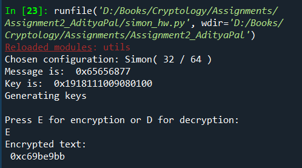
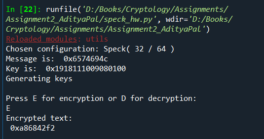

# 1. Implementation of Simon 32/64

Simon is a family of lightweight block ciphers that has been optimized for performance in hardware implementations. It was publicly released by the National Security Agency (NSA) in June 2013. The file `simon.py` is a Python implememtation of Simon 32/64 that operates on a block size of 32 with a 64 bit key. In the implementation, __ECB__ mode has been used. 

### Executing the code

In order to execute the code, follow the steps below:
- Write the text to be encrypted in `sample_msg.txt` file.
- Enter the 64 bit key in `key.txt` file.
- Execute `simon.py` file and press __E__ for encryption or __D__ for decryption.
- Encryption saves the cipher-text in `ciphertext.txt` file.
- Decryption reads the cipher-text from `ciphertext.txt` file.
   
### Evaluation of code

For testing the correctness of `simon.py` code, Simon test vector is tested from [this paper](https://eprint.iacr.org/2013/404.pdf). For reproducing the result, enter `eehw` in `sample_msg.txt` file and enter `0001100100011000000100010001000000001001000010000000000100000000
` in `key.txt` file. The result obtained is `0xc69be9bb` as indicated in the paper and is shown in the image below:

  

# 2. Implementation of Speck 32/64

Speck is a family of lightweight block ciphers that has been optimized for performance in software implementations. It was publicly released by the National Security Agency (NSA) in June 2013. The file `speck.py` is a Python implememtation of Speck 32/64 that operates on a block size of 32 with a 64 bit key. In the implementation, __ECB__ mode has been used. 

### Executing the code

In order to execute the code, follow the steps below:
- Write the text to be encrypted in `sample_msg.txt` file.
- Enter the 64 bit key in `key.txt` file.
- Execute `speck.py` file and press __E__ for encryption or __D__ for decryption.
- Encryption saves the cipher-text in `ciphertext.txt` file.
- Decryption reads the cipher-text from `ciphertext.txt` file.
   
### Evaluation of code

For testing the correctness of `speck.py` code, Speck test vector is tested from [this paper](https://eprint.iacr.org/2013/404.pdf). For reproducing the result, enter `etiL` in `sample_msg.txt` file and enter `0001100100011000000100010001000000001001000010000000000100000000
` in `key.txt` file. The result obtained is `0xa86842f2` as indicated in the paper and is shown in the image below:

  

 